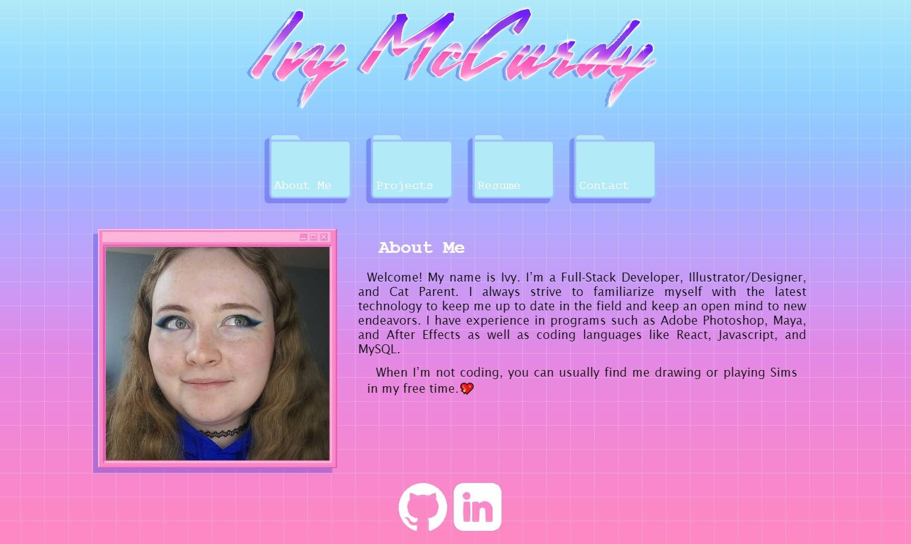

# Full Stack Web Developer Portfolio 

## Description 

As the Bootcamp comes to a close, it's crucial to showcase what I can do and what I've learned. What better way to do that then revamp my portfolio? 
With React now under my belt, I can now flex those skills and put my best foot forward. 

## Usage


Check out the deployed site <a href="">here</a>!

## User Story

```
AS AN employer looking for candidates with experience building single-page applications
I WANT to view a potential employee's deployed React portfolio of work samples
SO THAT I can assess whether they're a good candidate for an open position
```

## Acceptance Criteria 

```
GIVEN a single-page application portfolio for a web developer
WHEN I load the portfolio
THEN I am presented with a page containing a header, a section for content, and a footer
WHEN I view the header
THEN I am presented with the developer's name and navigation with titles corresponding to different sections of the portfolio
WHEN I view the navigation titles
THEN I am presented with the titles About Me, Portfolio, Contact, and Resume, and the title corresponding to the current section is highlighted
WHEN I click on a navigation title
THEN the browser URL changes and I am presented with the corresponding section below the navigation and that title is highlighted
WHEN I load the portfolio the first time
THEN the About Me title and section are selected by default
WHEN I am presented with the About Me section
THEN I see a recent photo or avatar of the developer and a short bio about them
WHEN I am presented with the Portfolio section
THEN I see titled images of six of the developer’s applications with links to both the deployed applications and the corresponding GitHub repositories
WHEN I am presented with the Contact section
THEN I see a contact form with fields for a name, an email address, and a message
WHEN I move my cursor out of one of the form fields without entering text
THEN I receive a notification that this field is required
WHEN I enter text into the email address field
THEN I receive a notification if I have entered an invalid email address
WHEN I am presented with the Resume section
THEN I see a link to a downloadable resume and a list of the developer’s proficiencies
WHEN I view the footer
THEN I am presented with text or icon links to the developer’s GitHub and LinkedIn profiles, and their profile on a third platform (Stack Overflow, Twitter)
```

## Credits 

Fade In effect - <a href="https://www.geeksforgeeks.org/how-to-create-fade-in-effect-on-page-load-using-css/">Sayantanm19</a> on GeeksforGeeks

Form Spark Contact Form - Tutorial by <a href="https://www.youtube.com/watch?v=T3NHNuD60h4&ab_channel=codebubb">codebubb</a> on Youtube

Rotate CSS - <a href="https://thebrandsmen.com/css-image-hover-effects/">Brandsmen</a>

GitHub Logo - <a href="https://www.vecteezy.com/vector-art/17119660-github-logo-git-hub-icon-with-text-on-white-and-black-background">Raazi Muhammed K</a> on Vecteezy

LinkedIn Logo - <a href="https://www.vecteezy.com/png/18930587-linkedin-logo-png-linkedin-icon-transparent-png">logoking</a> on Vecteezy

All other assets are drawn and created by me <3